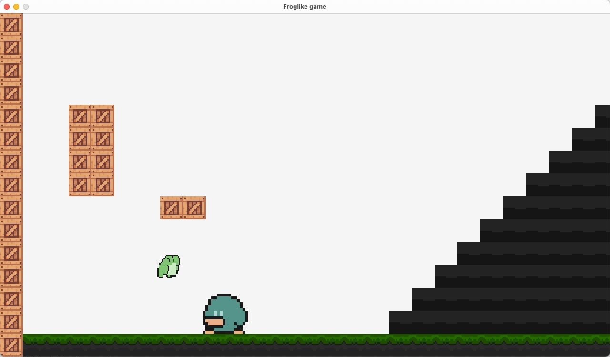

- frog assets source: https://duckhive.itch.io/froggo
- hero assets source: https://duckhive.itch.io/ducky
- ground assets source: https://fnkqrsho.itch.io/swamp-2d-platformer-tilesets

### SETUP

Go to https://github.com/raysan5/raylib/blob/master/src/config.h#L72 and uncomment `SUPPORT_CUSTOM_FRAME_CONTROL` flag

### ScreenShot

